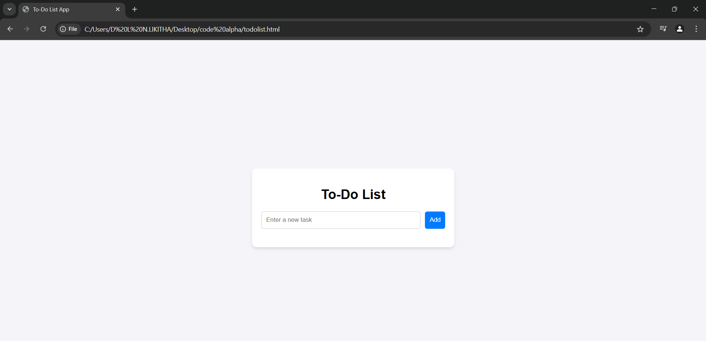
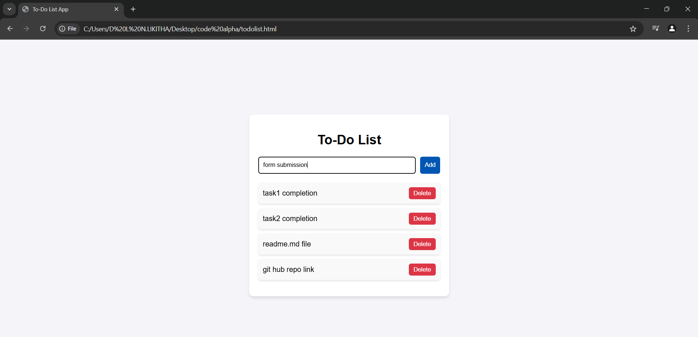
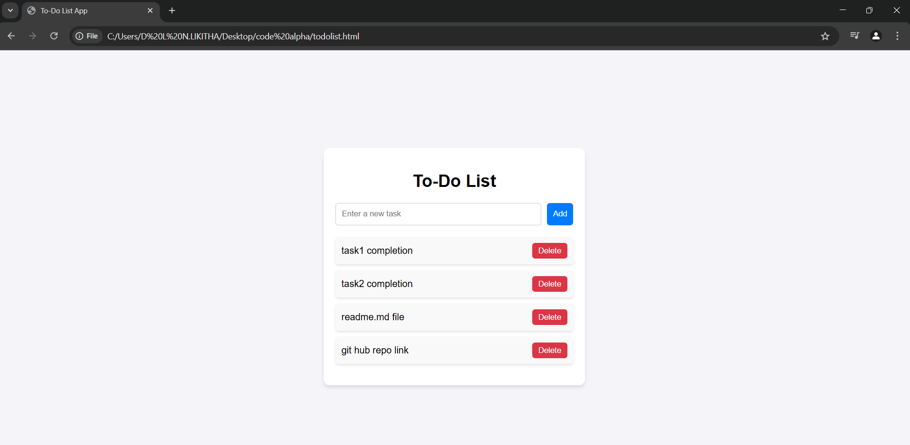

# To-Do List Web Application

## 📌 Overview
The **To-Do List** is a simple and efficient task management web application that allows users to create, save, and organize their daily tasks effortlessly.

## 🚀 Features
- Add tasks dynamically
- Delete completed tasks
- User-friendly interface with real-time updates

## 🛠️ Technologies Used
- HTML
- CSS
- JavaScript

## 🔧 How to Use
1. Enter your task in the input field.
2. Click the **Add Task** button to save it.
3. Your task will appear in the list below.
4. Click the **Delete** button next to a task to remove it from the list.

## 📸 Screenshot

## 🔗 Live Demo
[Click here to view the live demo](#)

## 🤝 Contributing
Feel free to fork this repository, make improvements, and submit a pull request!

## 📝 License
This project is licensed under the MIT License. Happy coding! 🚀