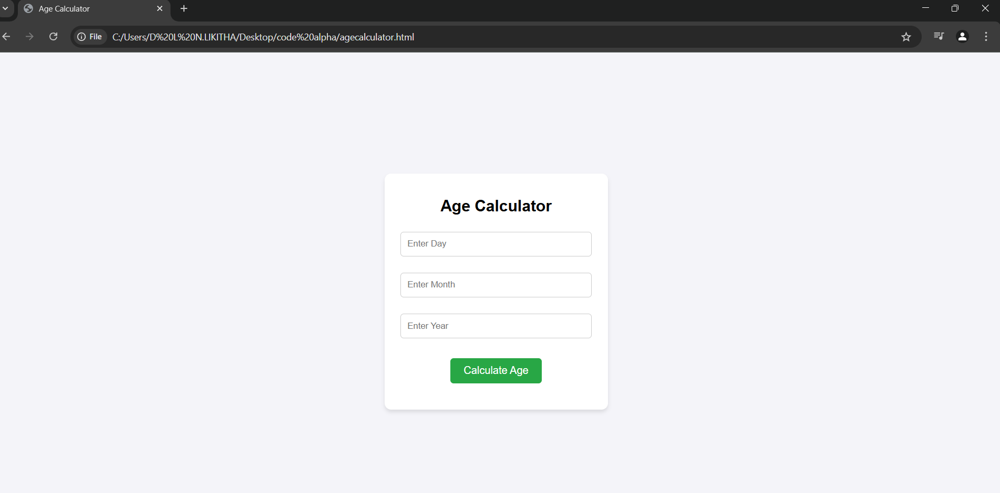
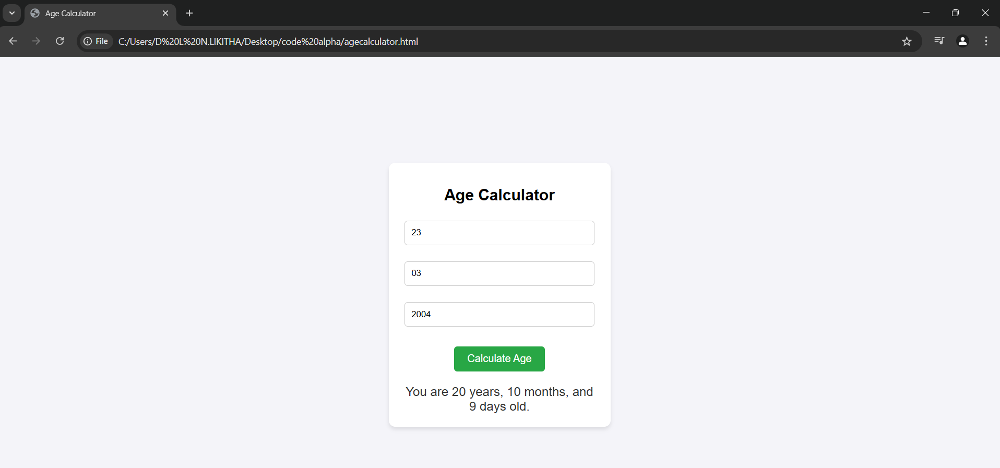
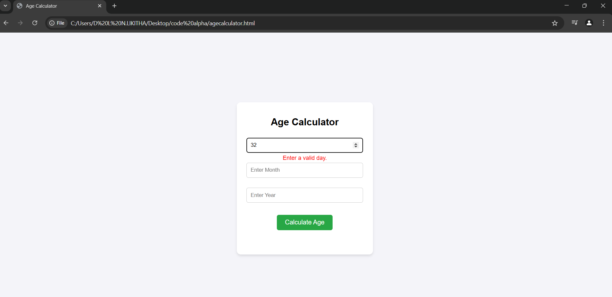
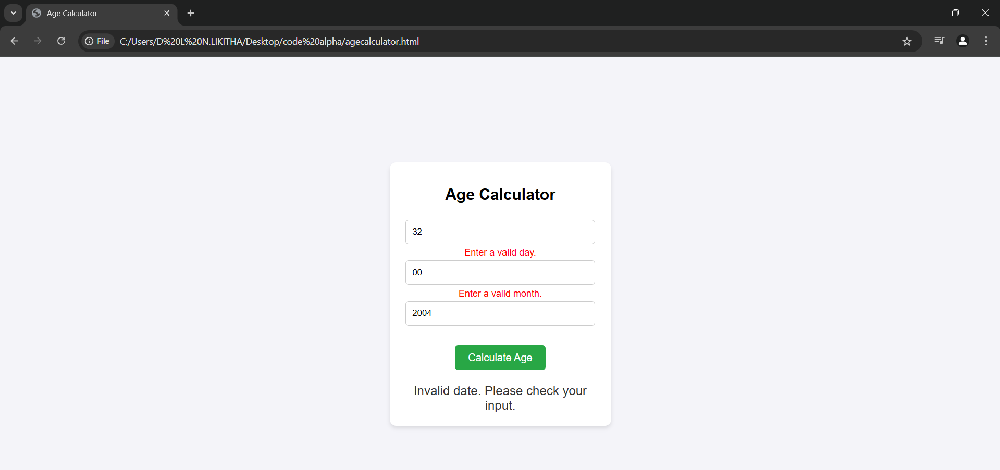

# Age Calculator

## 📌 Overview
The **Age Calculator** is a simple web-based tool that allows users to calculate their exact age in years, months, and days by entering their date of birth.

## 🚀 Features
- Input validation for day, month, and year
- Real-time error messages for invalid inputs
- Accurate calculation of years, months, and days
- Responsive and user-friendly design

## 🛠️ Technologies Used
- HTML
- CSS
- JavaScript

## 🔧 How to Use
1. Enter your birth date, month, and year in the input fields.
2. The app validates your input in real time.
3. Click the **Calculate Age** button to get your exact age.
4. If any field is invalid, an error message will be displayed below the respective input.

## 📸 Screenshot

## 🤝 Contributing
Feel free to fork this repository, make improvements, and submit a pull request!

## 📝 License
This project is licensed under the MIT License. Enjoy coding! 🚀

