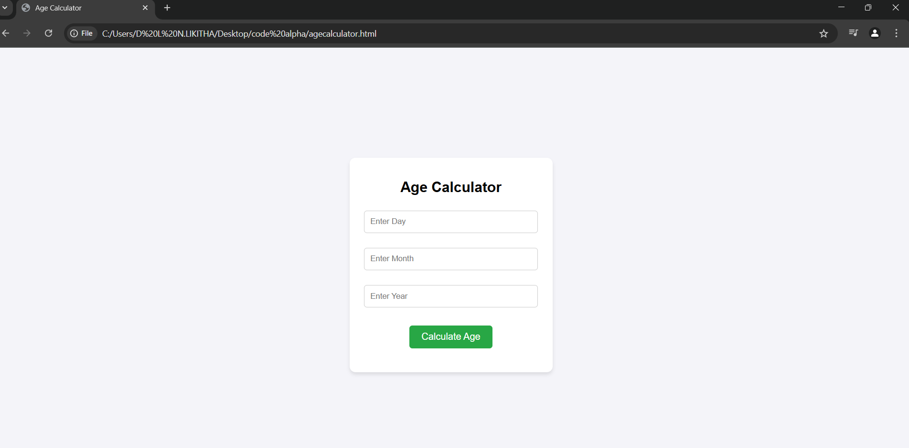
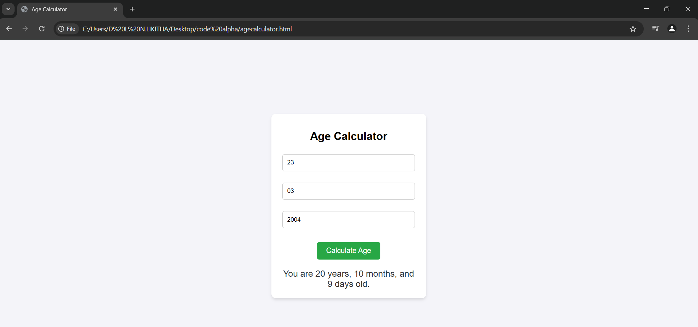
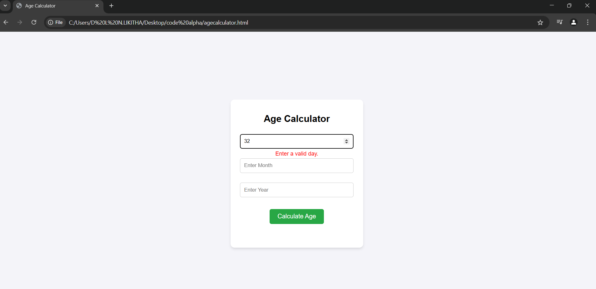
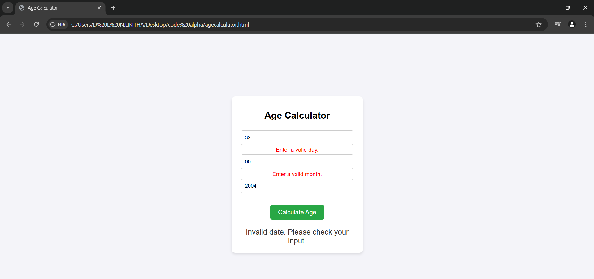
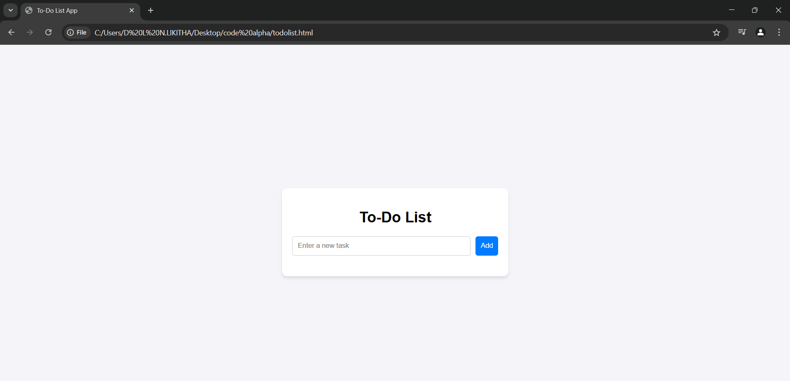
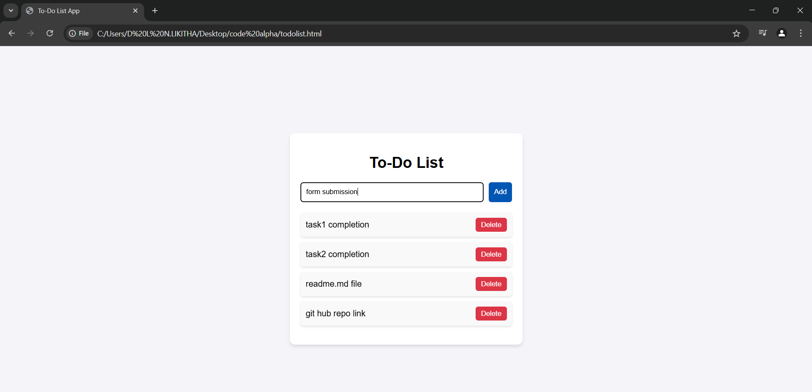
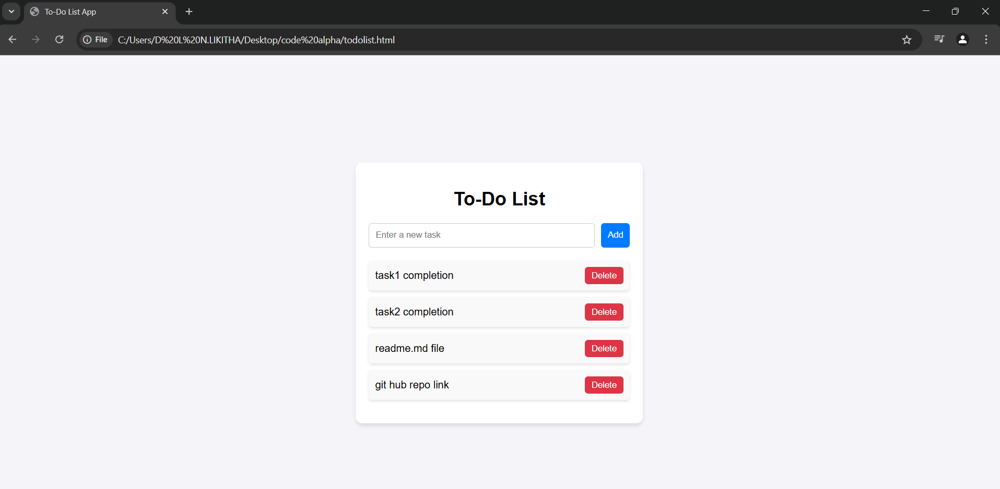

# **Age Calculator & To-Do List Web Applications**
This repository contains two web-based projects:
# **Task 1**
1. **Age Calculator** – A simple tool to calculate a user's age based on their date of birth.
# **Task 2**
2. **To-Do List** – A task management web application to create, save, and organize daily tasks.
---
Both projects are built using **HTML, CSS, and JavaScript**.


## 📌 **Age Calculator**
### **Features**
- ✅ Users can enter their **Date of Birth (Day, Month, Year)**.
- ✅ Calculates and displays the **exact age in years, months, and days**.
- ✅ Uses **JavaScript's built-in Date functions** for accurate calculations.
- ✅ Simple and **user-friendly interface**.

### **Installation & Usage**
1. **Clone the repository:**
   ```sh
   git clone https://github.com/21B01A0542CSE/codealpha_tasks.git
   ```
2. **Navigate to the Age Calculator file.**
3. **Open `agecalculator.html` in any web browser.**

---

## ✅ **To-Do List**
### **Features**
- 📌 **Add tasks dynamically** with an input field.
- 📌 **Delete tasks** when completed.
- 📌 **Real-time UI updates** using JavaScript.
- 📌 **Minimal and clean design**.

### **Installation & Usage**
1. **Clone the repository:**
   ```sh
   git clone https://github.com/21B01A0542CSE/codealpha_tasks.git
   ```
2. **Navigate to the To-Do List file.**
3. **Open `todolist.html` in any web browser.**

---

## 🛠 **Technologies Used**
- **HTML** – Structure of the web pages.
- **CSS** – Styling for a responsive and clean UI.
- **JavaScript** – Dynamic behavior and functionality.

---

## 📌 **Screenshots**







---


## 🤝 **Contributing**
Feel free to contribute by opening an **issue** or submitting a **pull request**. 

1. **Fork the repository.**
2. **Create a new branch:**
   ```sh
   git checkout -b feature-name
   ```
3. **Commit your changes:**
   ```sh
   git commit -m "Add new feature"
   ```
4. **Push to the branch:**
   ```sh
   git push origin feature-name
   ```
5. **Open a pull request.**

---

## 📧 **Contact**
For any queries or suggestions, feel free to reach out:
- **GitHub:** [21B01A0542CSE](https://github.com/21B01A0542CSE)
- **Email:** 21b01a0542@svecw.edu.in
